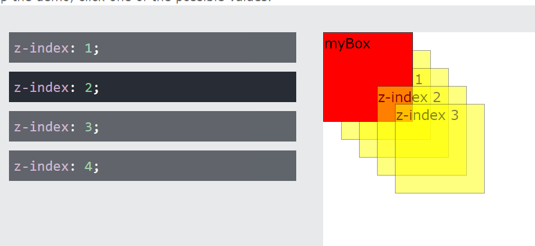
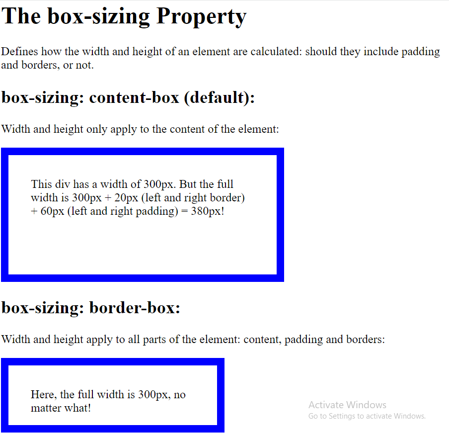

## inline 
Compared to display: inline, the major difference is that display: inline-block allows to set a width and height on the element.

Also, with display: inline-block, the top and bottom margins/paddings are respected, but with display: inline they are not.

Compared to display: block, the major difference is that display: inline-block does not add a line-break after the element, so the element can sit next to other elements.

## background-size: cover
Resize the background image to cover the entire container, even if it has to stretch the image or cut a little bit off one of the edges


## transform
The transform property applies a 2D or 3D transformation to an element. This property allows you to rotate, scale, move, skew, etc., elements.

### transform-translate
The translate() method moves an element from its current position (according to the parameters given for the X-axis and the Y-axis).

- Example
    ```
    div {
    transform: translate(50px, 100px);
    }
    ```

## position
The position property specifies the type of positioning method used for an element (static, relative, fixed, absolute or sticky).   
There are five different position values:

- static
- relative
- fixed
- absolute
- sticky

### position-static
HTML elements are positioned static by default.

Static positioned elements are not affected by the top, bottom, left, and right properties.

An element with position: static; is not positioned in any special way; it is always positioned according to the normal flow of the page:

This ```<div>``` element has position: static;
Here is the CSS that is used:
```
div.static {
  position: static;
  border: 3px solid #73AD21;
}
```

## position-relative
An element with position: relative; is positioned relative to its normal position.

Setting the top, right, bottom, and left properties of a relatively-positioned element will cause it to be adjusted away from its normal position. Other content will not be adjusted to fit into any gap left by the element.

This ```<div>``` element has position: relative;
Here is the CSS that is used:
```
div.relative {
  position: relative;
  left: 30px;
  border: 3px solid #73AD21;
}
```

## position-absolute
position: absolute;
An element with position: absolute; is positioned relative to the nearest positioned ancestor (instead of positioned relative to the viewport, like fixed).

However; if an absolute positioned element has no positioned ancestors, it uses the document body, and moves along with page scrolling.

Note: Absolute positioned elements are removed from the normal flow, and can overlap elements.

Here is a simple example:
```
div.absolute {
  position: absolute;
  top: 80px;
  right: 0;
  width: 200px;
  height: 100px;
  border: 3px solid #73AD21;
}
```

### flex 
The flex property sets the flexible length on flexible items.

__Note:__ If the element is not a flexible item, the flex property has no effect.

flex 1 means the following :
```
flex-grow : 1;    ➜ The div will grow in same proportion as the window-size       
flex-shrink : 1;  ➜ The div will shrink in same proportion as the window-size 
flex-basis : 0;   ➜ The div does not have a starting value as such and will 
                     take up screen as per the screen size available for
                     e.g:- if 3 divs are in the wrapper then each div will take 33%.
```

### justify-content : space-between
The flex items are placed with even spacing where the item is pushed to start and the last item is pushed to end.
The "justify-content: space-between;" displays the flex items with space between the lines:

### flex-basis
The flex-basis property in CSS is used to specify the initial size of the flexible item. The flex property is not used if the element is not flexible item.

__Syntax:__
```
flex-basis: number|auto|initial|inherit;
```

- number: It is a length unit that define the initial length of that item.
- auto: It is the default value, if the length is not specified the length will be according to it’s content.
- initial: It sets the property to it’s default value.
- inherit: It specifies that a property should inherit its value from its parent element.

## z-index
The z-index property specifies the stack order of an element.

An element with greater stack order is always in front of an element with a lower stack order.



## box-sizing

The box-sizing property defines how the width and height of an element are calculated: should they include padding and borders, or not.


